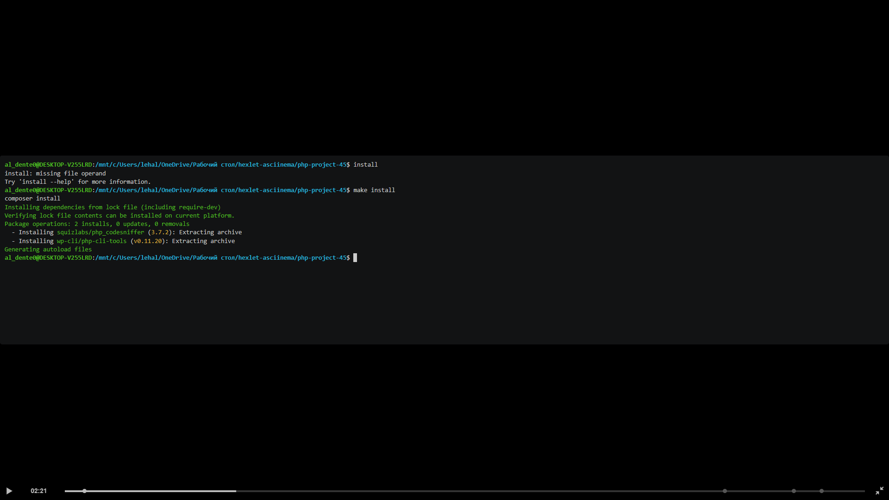
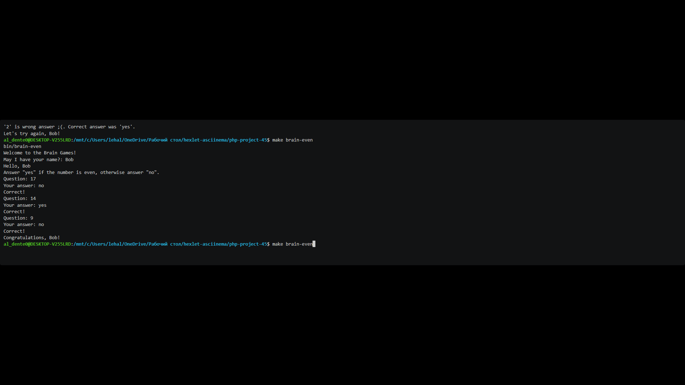
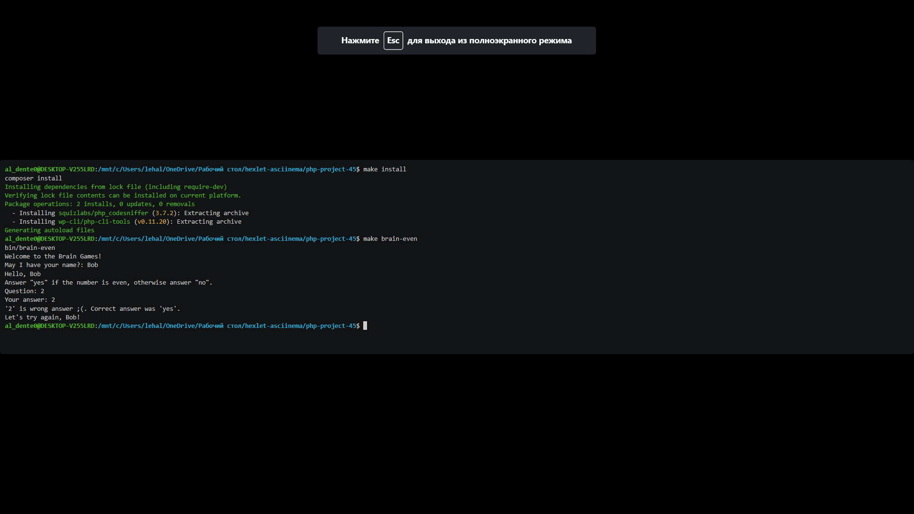
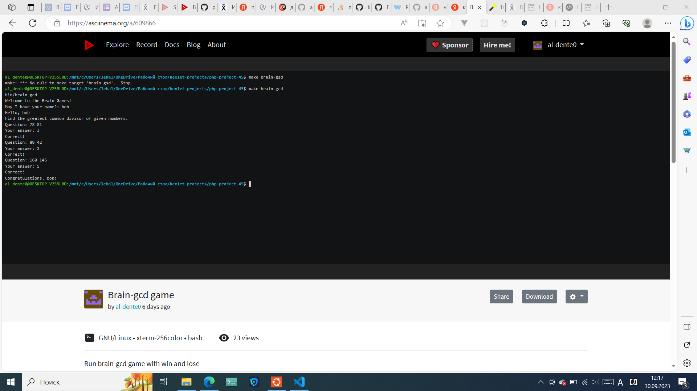
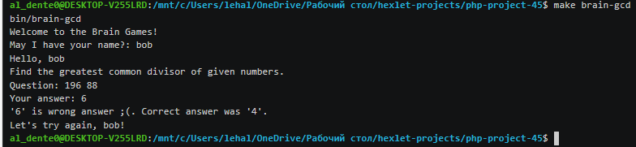
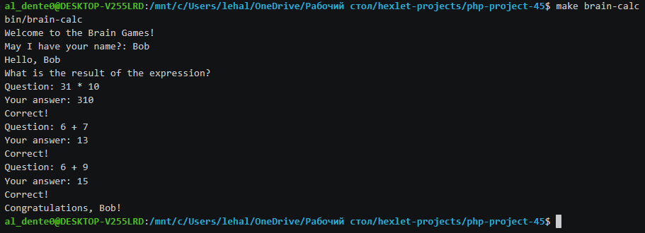
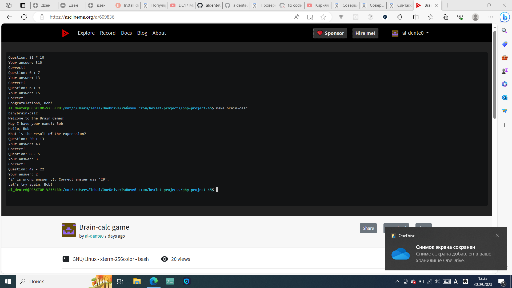
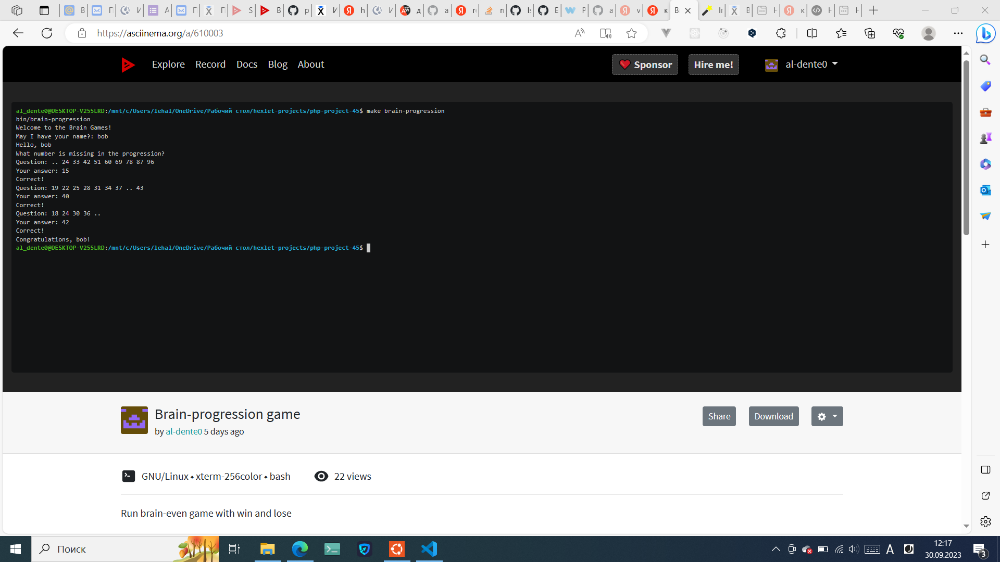
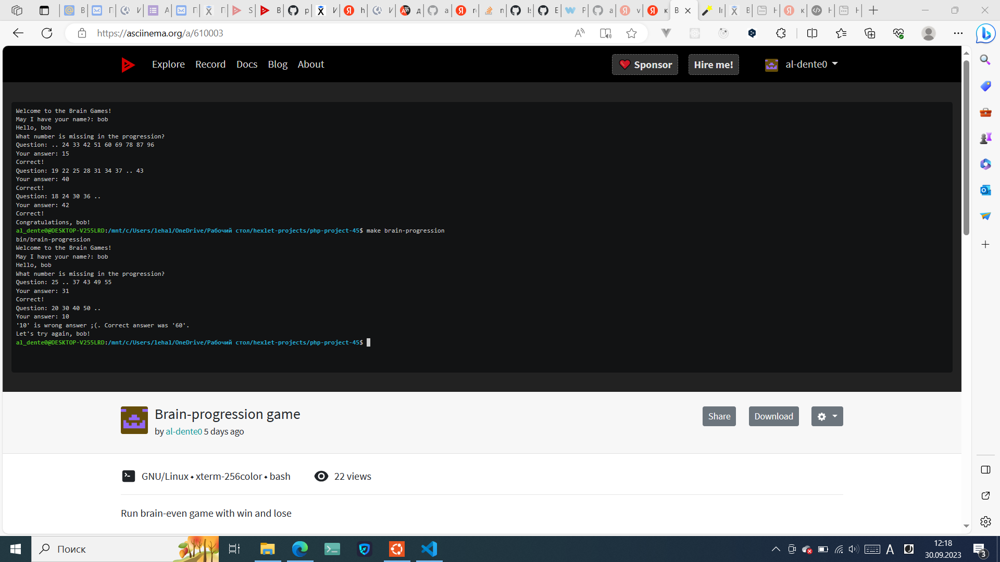
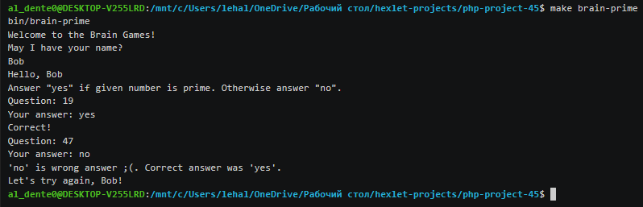

## Hexlet tests and linter status:

# Brain Games

This is a set of 5 console math games: brain-even, brain-prime, brain-progression, brain-calc and brain-gcd.

## Requirements

composer >= 2.5.8 to install dependencies.
php >= 8.1.2 to run games.

## Install dependencies:

## Brain-even

The brain-even is a game in which you need to determine an even number or not.

Asciinema: https://asciinema.org/a/609488

### Run brain-even and win:

### Run brain-even and lose:

## Brain-gcd

The brain-gcd is a game in which you need to determine the greatest common multiplier (GCD) of two numbers.

Asciinema: https://asciinema.org/a/609488

### Run brain-gcd and win:

### Run brain-gcd and lose:

## Brain-calc

The brain-calc is a game in which you need to calculate the value of an expression.

Asciinema: https://asciinema.org/a/609836

### Run brain-calc and win:

### Run brain-calc and lose:

## Brain-progression

The brain-progression is a game in which you need to determine the missing number of an arithmetic sequence.

Asciinema: https://asciinema.org/a/610003

### Run brain-progression and win:

### Run brain-progression and lose:

## Brain-prime

The brain-prime is a game in which you need to determine an prime number or not.

Asciinema: https://asciinema.org/a/610412

### Run brain-prime and win:

### Run brain-prime and lose:

